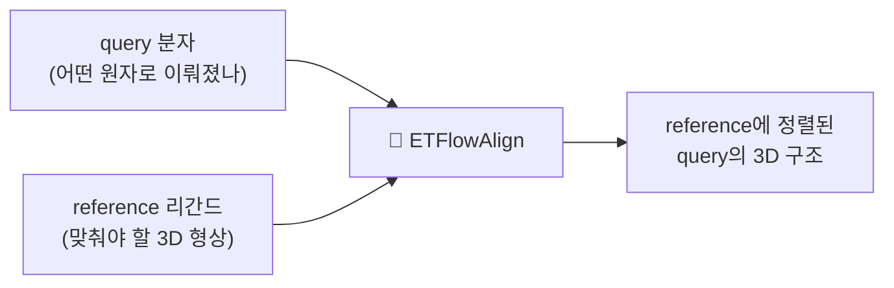
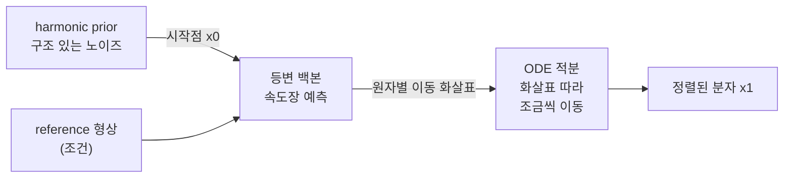

# ETFlowAlign

**DiffAlign의 확산(diffusion) 엔진을 ET-Flow의 flow matching으로 교체한 분자 정렬 생성 모델.**

DiffAlign의 **과제**(reference 리간드 형상에 정렬된 query 3D 구조를 노이즈에서 생성)를, ET-Flow의 **엔진**(flow matching + ODE 적분 + harmonic prior + 등변 백본) 위에서 다시 구현한 연구 저장소입니다.

---

## ETFlowAlign이란? (한눈에)

**한 분자(query)를, 기준이 되는 다른 분자(reference)의 3D 모양에 겹쳐지도록 새로 빚어내는 AI 모델**입니다.
신약 개발에서 "효과가 알려진 분자와 비슷한 형태의 새 분자를 찾는" **분자 정렬(molecular alignment)** 작업을 자동화합니다.

> 비유: **찰흙 덩어리(노이즈)를 조금씩 밀어서, 기준 틀(reference 형상)에 딱 맞는 분자 모양으로 빚어내는 것.**



---

## 어떻게 생성하나 (엔진)

완전 무작위 노이즈가 아니라 **구조가 있는 노이즈(harmonic prior)**에서 시작해서,
신경망(**등변 백본**)이 알려주는 **"각 원자를 어디로 옮길지" 화살표(속도장)**를 따라
여러 번 조금씩 움직여(**ODE 적분**) 최종 분자 모양을 만듭니다.



한 줄 요약: `harmonic prior → (reference 조건) 등변 속도장 → ODE → 정렬된 분자`

---

## 용어 설명 (수식)

$N$ = 원자 수, $x \in \mathbb{R}^{N\times 3}$ = 원자 좌표, $t \in [0,1]$ = 시간, $\theta$ = 신경망 파라미터.

| 용어 | 수식 정의 |
|---|---|
| **원자종 · 결합** | 분자 = 그래프 $\mathcal{G}=(z,\,E)$, 원자종 $z \in \mathbb{Z}^{N}$, 결합 $E \subseteq \{(i,j)\}$ |
| **query / reference** | query: $(z^q, E^q)$ + 타깃 $x_1 \in \mathbb{R}^{N_q\times 3}$ ／ reference: $(z^r, x^r)$, $x^r \in \mathbb{R}^{N_r\times 3}$ |
| **harmonic prior** | $x_0 \sim \mathcal{N}(0,\,L^{+})$, 라플라시안 $L=D-A$, 에너지 $E(x)=\tfrac12\,x^\top L x$;  샘플 $x_0 = U\,\mathrm{diag}(\lambda^{-1/2})\,\varepsilon,\ \varepsilon\sim\mathcal{N}(0,I)$ |
| **속도장 $v_\theta$** | $v_\theta:(x_t,\,t)\mapsto v_\theta(x_t,t)\in\mathbb{R}^{N\times 3}$, 흐름 $\dfrac{dx}{dt}=v_\theta(x,t)$ |
| **flow matching (학습)** | 경로 $x_t=(1-t)\,x_0+t\,x_1$, 목표 $u=x_1-x_0$, 손실 $\mathcal{L}=\mathbb{E}\,\lVert v_\theta(x_t,t)-u\rVert^2$ |
| **등변 백본** | $\forall R\in SO(3),\ \tau\in\mathbb{R}^3:\ v_\theta(Rx+\tau,\,t)=R\,v_\theta(x,t)$  (스칼라 피처 $h(Rx)=h(x)$) |
| **조건화** | reference 조건부 속도장 $v_\theta(x_t,\,t \mid x^r)$  (무조건: $v_\theta(x_t,t)$) |
| **상대 기하** | 거리 $r_{ij}=\lVert x_j-x_i\rVert$ (불변), 방향 $\hat{u}_{ij}=\dfrac{x_j-x_i}{r_{ij}}$ (등변); 절대 $x_i$ 대신 $(r_{ij},\hat u_{ij})$만 입력 |
| **UFF Guidance** | 추론 시 $v \leftarrow v_\theta(x,t) - \gamma\,\nabla_x E_{\mathrm{UFF}}(x;\,\mathrm{pocket})$ ($\gamma$=세기, $E_\mathrm{UFF}$=UFF 에너지) |
| **ODE 적분** | $x_1 = x_0 + \displaystyle\int_0^1 v_\theta(x_t,t)\,dt$;  Euler: $x_{t+\Delta t}=x_t+\Delta t\,v_\theta(x_t,t)$ |

### 입출력 정리
- **입력**: query 분자 그래프(원자종·결합) + reference 리간드의 3D 형상
- **출력**: reference에 정렬된 query의 3D 좌표
- **조건화 규칙**: reference만 네트워크에 넣음(포켓은 추론 시 UFF Guidance로만). 좌표는 **상대 기하로만** 넣어 회전·이동 대칭(SE(3) 등변성) 유지.

전체 설계 명세는 [`etflowalign/SPEC.md`](etflowalign/SPEC.md), 단계별 진행 현황은 [`etflowalign/tree.txt`](etflowalign/tree.txt)에 있습니다.

---

## 저장소 구조

```
ETFlowAlign/
├── etflowalign/            # 새로 구현한 핵심 코드 (백지 재구축)
│   ├── SPEC.md             #   설계 캐논(태스크·조건·백본·게이트·비목표)
│   ├── tree.txt            #   Phase별 작업 분해 + 진행 추적
│   ├── SERVER_RUN.md       #   서버(SLURM) 실행 가이드
│   ├── backbone/           #   등변 벡터-피처 트랜스포머(자작)
│   ├── flow/               #   harmonic prior · 보간 경로 · 손실
│   ├── data/               #   정렬쌍 SDF → 텐서 변환
│   ├── scripts/            #   데이터 빌드·진단·학습 러너
│   └── tests/              #   등변성·데이터·조건화 단위 검증
├── external/
│   ├── diffalign/          # upstream DiffAlign (참조)
│   └── etflow/             # upstream ET-Flow (참조)
└── third_party_licenses/   # 원본 라이선스 원문
```

---

## `etflowalign` 패키지 구성

| 모듈 | 내용 |
|---|---|
| `backbone/` | self-contained 등변 벡터-피처 트랜스포머(TorchMD-Net/PaiNN 계열). 스칼라 `h`(불변) + 벡터 `vec`(등변) 동시 갱신. 등변성 오차 ~1e-15 검증 |
| `flow/` | harmonic prior(결합 라플라시안 기반), linear flow-matching 경로, batchwise-l2 손실, Kabsch source→target 정렬 |
| `data/` | GEOM-Drugs 유사분자 정렬쌍 SDF → per-sample 텐서. reference/query 분리 |
| `sampler.py` | ODE(Euler) 적분 생성. 포켓 UFF 가이던스 훅(예정) |
| `train.py` | flow-matching 학습(EMA, NaN 방어, source 정렬, 다중 샘플) |
| `tests/` | 등변성, 스모크 실행, 데이터 왕복, 조건부 학습/샘플 |

**설계 원칙**: `backbone/`은 태스크·조건을 모르는 순수 등변 네트워크로 격리 → 단독 검증 가능. 등변성은 코드가 아니라 **단위테스트로 강제**.

---

## 진행 현황

| Phase | 내용 | 상태 |
|---|---|---|
| 0 설계 | SPEC 고정 | ✅ 완료 |
| 3 백본 | 등변 벡터-피처 트랜스포머 | ✅ 등변성 1e-15 |
| 4 조건화 | reference 형상 주입 | ✅ joint 등변 검증 |
| 1 데이터 | GEOM-Drugs 정렬쌍 텐서화 | ✅ 65k 빌드 |
| 2 flow 엔진 | prior+FM+ODE | ✅ 합성 소분자 생성 통과 |
| 5 overfit | 실분자 암기(용량 게이트) | 🔬 진행 중 — 실분자 생성 정밀도 조사 |
| 6 일반화 | full 65k + held-out | ⬜ 예정 |
| 7 평가+포켓 | DISCO RMSD + UFF 가이던스 | ⬜ 예정 |

> 현재 초점: 합성 소분자 생성은 되지만 **실제 약물 분자(링·복잡한 기하)의 생성 정밀도**가 관건. 측정·적분·개수·용량·조건화·cutoff 요인을 진단으로 배제하며 원인을 좁히는 중.

---

## 실행

### 로컬 검증 (수초, 코드 무결성 확인)
```bash
PYTHONPATH=. python -m etflowalign.tests.test_equivariance      # 백본 등변성
PYTHONPATH=. python -m etflowalign.tests.test_smoke_run         # flow 엔진 실행
PYTHONPATH=. python -m etflowalign.tests.test_data_pairs        # 데이터 왕복
PYTHONPATH=. python -m etflowalign.tests.test_conditional_flow  # 조건부 학습/샘플
```

### 서버 학습/진단 (SLURM)
자세한 내용은 [`etflowalign/SERVER_RUN.md`](etflowalign/SERVER_RUN.md) 참조.
```bash
# 예: overfit 진단 (SLURM 배치 제출)
N=20 sbatch etflowalign/scripts/run_overfit.sh
```

---

## 서드파티 라이선스

이 저장소는 아래 오픈소스 코드를 참조·활용합니다 (원문은 `third_party_licenses/`):

- **DiffAlign** (MIT License) — 정렬 태스크·데이터 구성 참조
- **ET-Flow** (MIT License) — flow matching 엔진·harmonic prior·등변 백본 참조
